* Identify the key components of the ML Lifecycle.
* Define “concept drift” as it relates to ML projects.
* Differentiate between shadow, canary, and blue-green deployment scenarios in the context of varying degrees of automation.
* Compare and contrast the ML modeling iterative cycle with the cycle for deployment of ML products.
* List the typical metrics you might track to monitor concept drift.

# Course

* C1 Introduction to Machine Learning in Production
  * C1W1 Week 1: Overview of the ML Lifecycle and Deployment
* C2 Machine Learning Data Lifesycle in Production
* C3 Machine Learning Modeling Pipelines in Production
* C4 Deploying Machine Learning Models in Production

# Note

## C1 Introduction to Machine Learning in Production

### Blueprint

machine learning project modules

machine learning project lifecycle
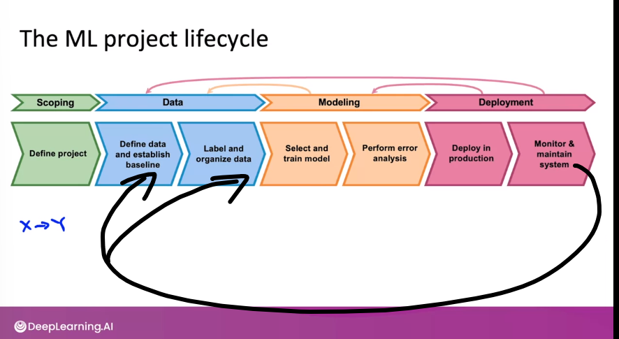

Three parts are equally important: Code + Hyperparamters + Data >> ML Model

MLOps(Machine Learning Operations): an emerging discipline, and comprises a set of tools and principles to support progress throughthe ML project lifecycle. **Systematic way of thinking**

Stages: Scoping >> Data >> Modeling >> Deployment
Iterative: First deployment v.s. Maintainence

### 1. Scoping

#### Scoping process

* Brainstorm business problems(not AI problem)
  * What are the top 3 things you wish were working better?
* Brainstorm AI solutions
* Assess the feasibility (dilligence): is it technically feasible?
  * Use external benchmark to evaluate(literature, other company, competitor)
  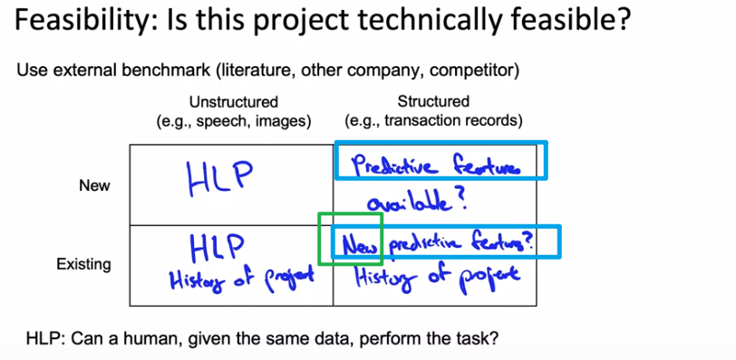
  * Do we have features that are predictive?
  * The history of the project
  * Dilligence on value (Fermi estimates)
  
* Assess potential solutions
* Determinate milestones
  * Key specifications:
    * ML metrics (accuracy, presicion/recall, etc)
    * Software matrics(latency, throughput,etc.given compute resources)
    * Business metrcs(revenue, etc)
* Budget for resources
  * Resources needed(data, personnel, help from other teams)
  * Timeline

**xhu_Note**:

1. Separating problem identification from solution and use each 'method' to solve eacn 'problem' (learned from marker_cleanup_post too)
2. What to achieve > How to achieve
3. Two dimension coordination system is quite useful to help sorting

### 2. Data

#### Define Data and Establish Baseline

Data defination: input X and target label Y

* Major type of data problems
  
  * Unstructured adata:
    * May or may not have huge collection of unalbeled exmpales x.
    * Human can label more data
    * Data agumentation more likely to be helpful
  * Structured data:
    * May be more difficult to obtain more data
    * Human labeling may not be possible
  * Small data:
    * Clean labels are critical
    
    * Can manually lookthrough dataset and fix labels
    * Can get all the labelers to talk to each others
  * Big Data:
    * Emphasis data process
    * (Big data sometimes have long tail of rare events in the input where clean labels are critical too < small data problem >)

**xhu note:** different Eng/Proj experiences might only map to one quadrant of above cordination system. (FT ?-> Structured + Big Data)

#### Label and organize data

* Improving label consistancy
  * Have multiple labelers label same example
  * Where there is disagree,emt, have MLE, subhect matter export (SME)and /or labeler discuss defination of y to reach
  * If labelers believe that x does NOT contrain enough information, consider changing x
  * Iterate until it is hard to significate improve the data
  * Have a class/label to capture uncertainty: 0 , borderline, 1
  * 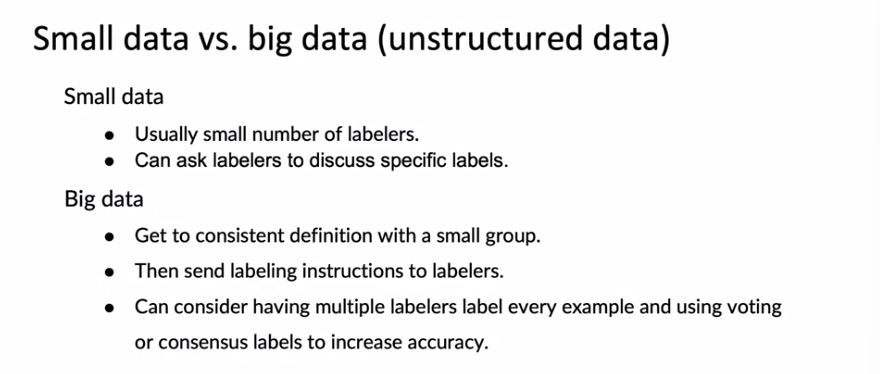

* Human level performance (HLP)
  * Why HLP? Estimate Bayes error / irreducible error to help with error analysis and prioritiaztion
  

#### Obtaining data

* Get into iteration loop as quickly as possible (Unless you have worked on the problem before and have sense of how much data it is need)
* Ask: How much data can we obtain in k days?
* Brainstorm list of data sources:
  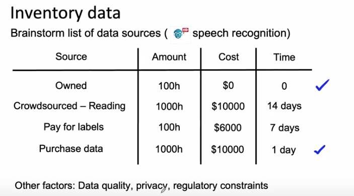
* Labeling data
  * Options: In-house v.s. outsourced v.s. crowdssourced
  * Don't increase data by more than 10x at a time
  * Label data yourself for a while to get the 'sense'

#### Data pipeline (in iteration)

* Make sure the scripts/data is replicable
* POC (proof-of-concept) > Production phases:
  * 
* Balanced train/dev/test splits
  * distribute 3 set equally in small data problems
  * random split will be representative
* Example: **keep track of data provenace and lineage** (using meta data is one of the methods)
    

### 3. Modeling

AI system = Code (algorithm/model) + Data
Model-centic AI development v.s. Data-centric AI development

#### Key changllenges

* Model development is an iterative process
  * 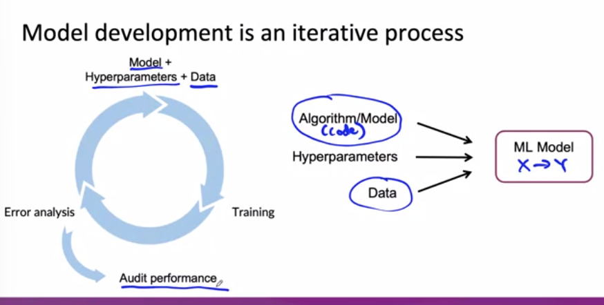
* Challenges in model development
  * Do well in : training set > dev/test set > business metric/project goals
  * Why low avg error isn't good enough: single std can not reflact on key slices
* Rare classes
  * Skewed data distribution
  * Accuracy in rare classes

#### Selecting and training model

* Establish a baseline
  * Establish a baseline level of performace
  * Unstructured and structured data: human good at unstructured v.s. machine good at structured
  * 
* Tips for getting started
  * Starting on modeling
    * literacture search to see what's possible (courses, blogs, open-source projects)
    * Find open-source implementations if avaiblable
    * A reasonable algorithm with good data will often outperform a great algorithm with no so good data > lastest != greatest
  * Sanity-check for code and algorithm
    * overfit a small training dataset before the large one

#### Error analysis

* Use tags can help catergoize issue
    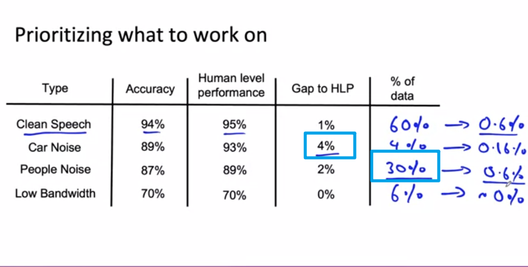
* Prioritizing what to work on
  * How much room for improvement there is
  * How frequently that category appears
  * How easy is to improve accuracy in that catergory
  * How important it is to improve in that catergory
* Adding/improving data for specific categories (for target catego)
  * Collect more data
  * Use data aguementation to get more data
  * Importve label accuracy / data quality

Example Analysis

Skewed dataset : large portion of data is '0'

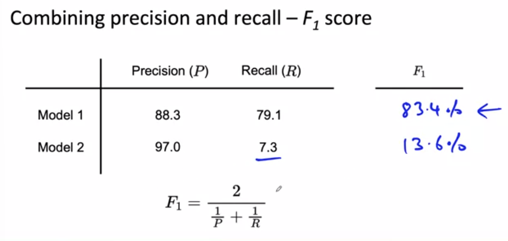

#### Performace auditing

Auditing framework

* Check for accuracy, fiarness/bias, and other probelms
  * Brainstore what might go wrong
  * Establish metrics

#### Data iteration Loop (during iteration of model)

**Model-centric view:** Take the data you have and develop a model that does as well as possible > Hold the data fixed and iteratively improve the code/mode
**Data-centric view:** The quality of the data is paramount. Use tools to improve the data quality; this will allow multiple models to do well > Hold the code fixed and iteratively improve the data

Example of data augmentation analysis

* Data augmentaiton
  * Goal: Create 'realistic' examples that algotiythm does poorly on but humans (or other baseline) can do well on
* Data iteration
  * 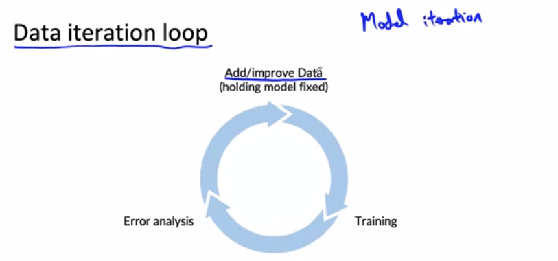
  * for unstructure data: If the model is sufficiently large (less bias), adding data will not hurts accuracy
  * for structure data: Adding features. (collebrative filter v.s. content filter aka cold-start filter)
* Experiment tracking (systematic)
  * 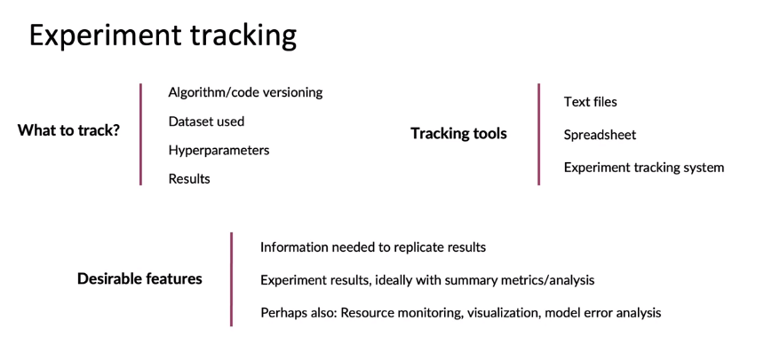

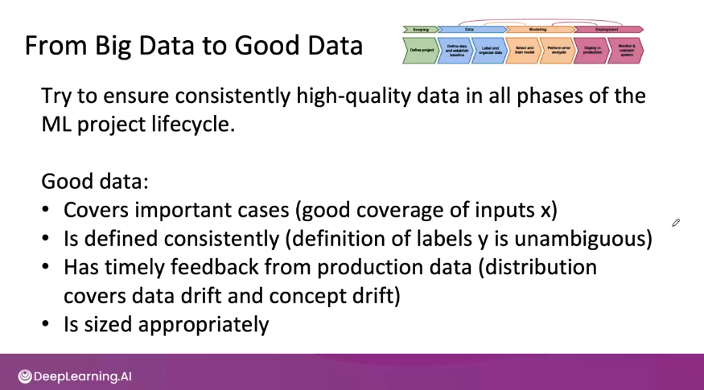

### 4. Deployment

#### Key challenges

* Concept drift & Data drift
  * Concept drift: X-> Y mapping drift
  * Data drift: training set/test set etc. gradual change / sudden shock
* Software engineering issues
  * Realtime or Batch
  * Cloud vs. Edge/Browser
  * Coupute resources (CPU/GPU/memory)
  * Latency, thoughput(QPS: query per seconds - e.g. 500ms)
  * Security and privacy

#### Deployment patterns

* Common deployment cases:
  * New oriduct/capaibility
  * Automate/assist with manual task
  * Replace previous ML system

* Common deployment methods:
  * Canary deployment : Gradual ramp up with monitoring or Rollback
  * Blue green deployment: Switch to new model directly but can swtich back
  * Degree of automation:
  Human only >> Shadow mode >> AI assistance >> Partial automation >> Full automation
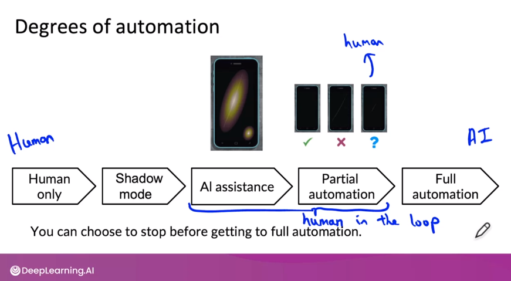

#### Monitoring + Maintainance

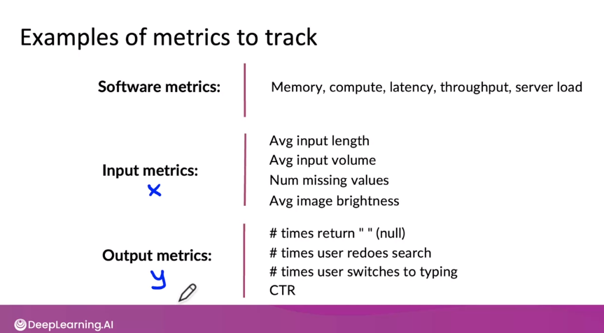
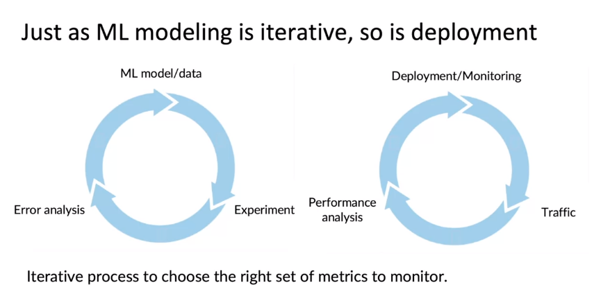

Ref:

* <https://papers.nips.cc/paper/2015/file/86df7dcfd896fcaf2674f757a2463eba-Paper.pdf>
* <http://arxiv.org/abs/2011.09926>
* <http://arxiv.org/abs/2010.02013>

## C2 Machine Learning Engineering for Production (MLOps) Specialization

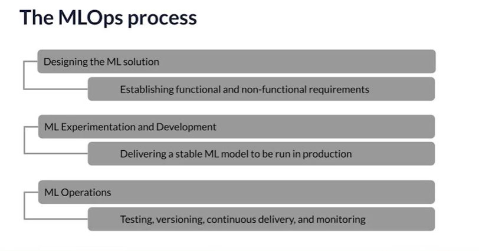

### Collecting,Labeling and Validating Data

* Production ML = ML development + software development
  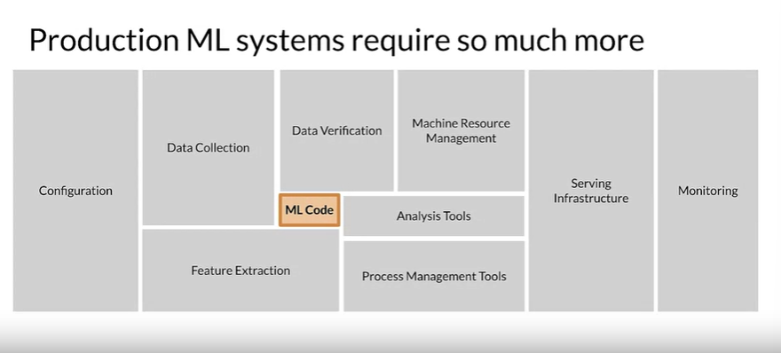
  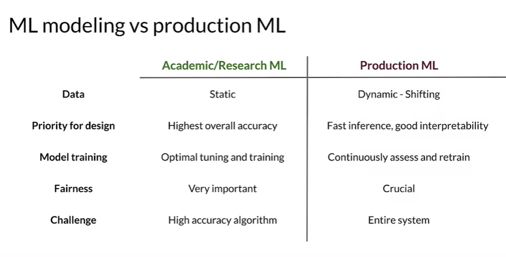
* Managing the entire life cycle of data
  * Labeling
  * Feature space coverage
  * Minimal dimensionality
  * Maximum predictive data
  * Fairness
  * Rare conditions
* Modern software development (Criterias)
  * Scalability
  * Extensibility
  * Configuration
  * Consistency & reproducibility
  * Safety & security
  * Modularity
  * Testability
  * Monitoring
* Challenges in production grade ML
  * Build itergrated ML system
  * Continuous operate it in production
  * Handle continuously changing data
  * Optimize compute resource costs

#### ML Pipelines

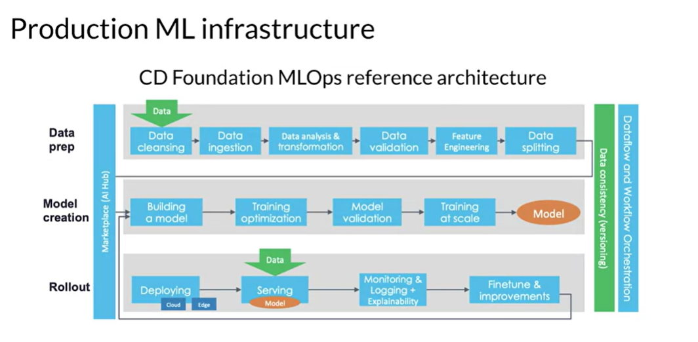
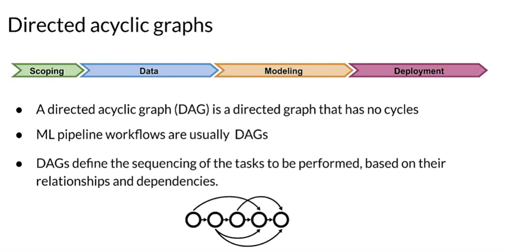

#### Collecting Data

data collect > ingest > prepare

* Importance of data quality
* Data pipeline: data collection, ingestion and preparation
* Data collection and monitoring
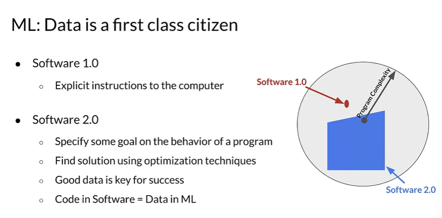

Key points:
  
  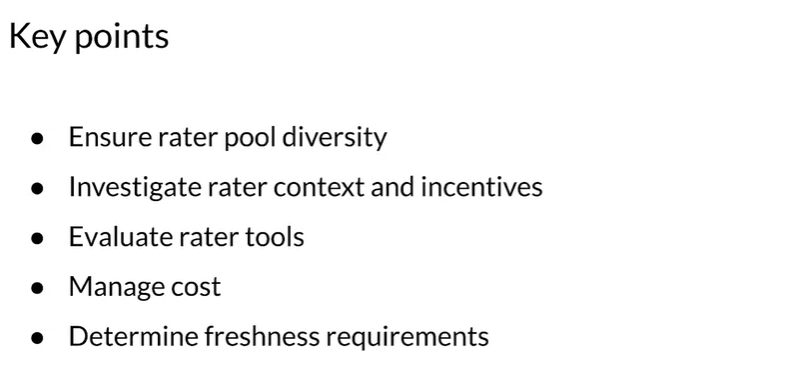

**xhu NOTE**

* Representational harms include perpetuating harmful stereotypes about or minimizing the existence of a social group, such as a racial, ethnic, gender, or religious group. Machine learning algorithms often commit representational harm when they learn patterns from data that have algorithmic bias.
* Rater categorise: generalist , experts & targer users

#### Labeling Data

* Model performance decays over time, and model retraining helps improve or maintain performance.
* Data labeling is a key part of supervised learning and needs to be approached based on the specific problem and domain.

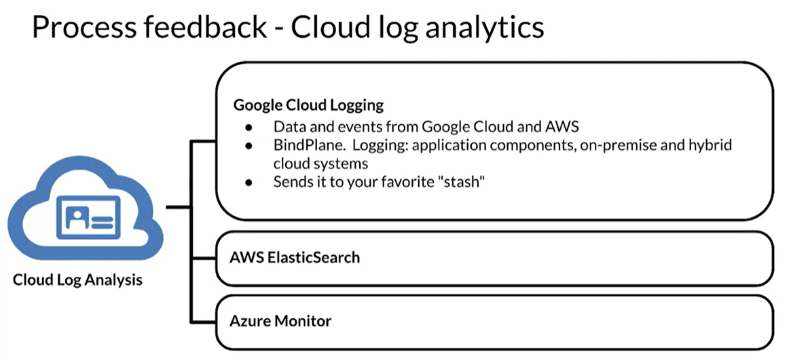

* Direct Labeling v.s. Derived Labeling (Human raters)

**xhu note**
Direct Labeling (aka Process Feedback) labels come from monitoring predictions, not from a "rater" as in this example. But what id we don't have data to log?:

* Use a heuristic for a first launch, then train a system based on logged data.
* Use logs from a similar problem to bootstrap your system.
* Use human raters to generate data by completing tasks.
* ref:<https://developers.google.com/machine-learning/data-prep/construct/collect/label-sources>

#### Validating Data
